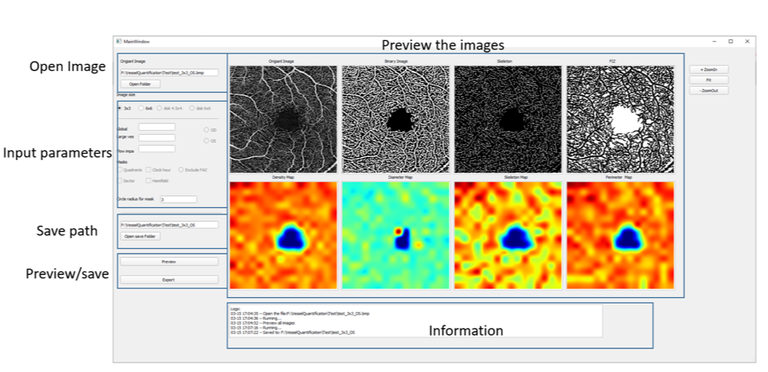
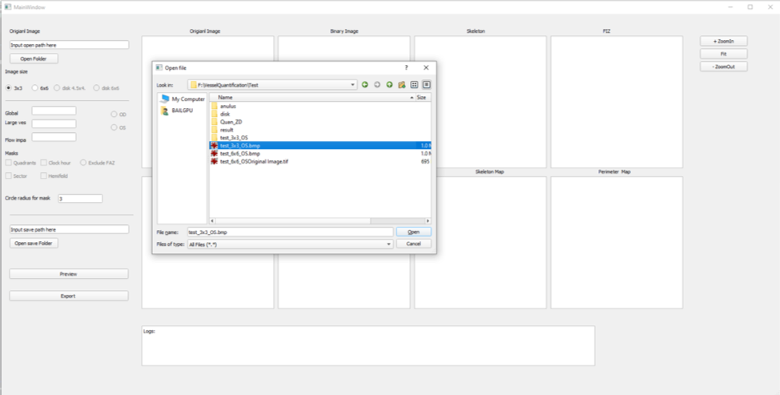
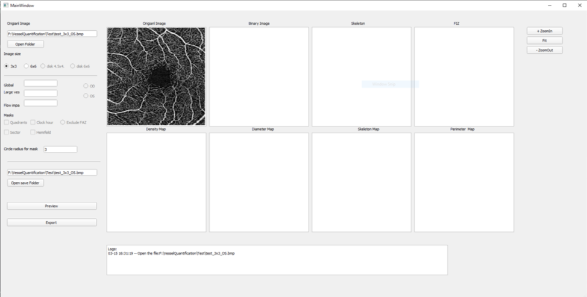
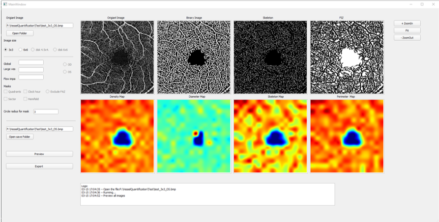
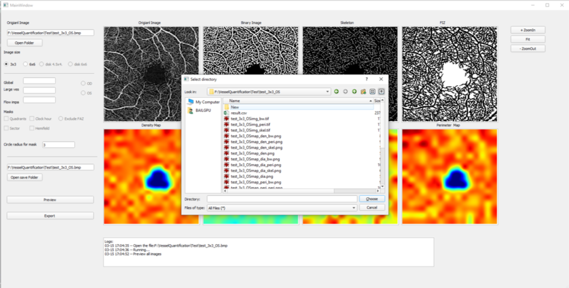
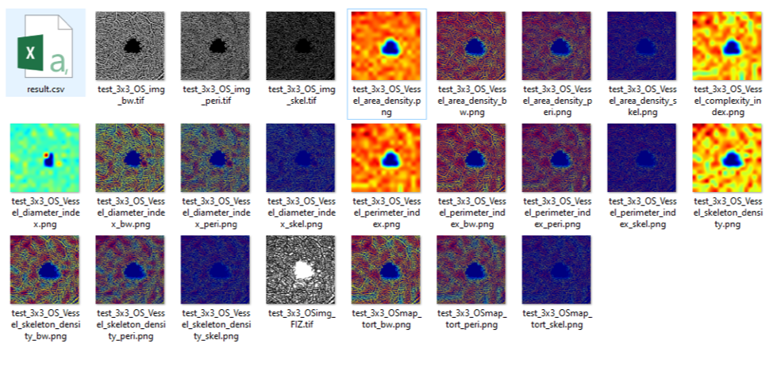
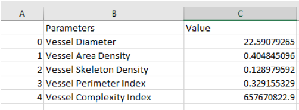

# Introduciton

Quantitative Analysis Software User Guide
## Overview:
This software provides an easy graphical user interface (GUI), based on python, to quantifying the vasculature in disk OCTA images.
 
 
## Installation
Uninstall the zip package under windows environment
Open the main.exe

## Usage

Step 1: Open the image
Use the Open Folder button to select the OCTA enface image to be processed.

 
Step 2: Select the parameters
Currently, user only need to select the size of the image, either select 4.5mm or 6mm
 

Step 3: Run the software
Click the button ’Preview’ to visualize quantitative maps:
First row from left to right:
Original OCTA image, binary vessel map, binary skeleton map and binary flow impairment zone map.
Second row from left to right:
Vessel area density color map, vessel diameter color map, vessel skeleton density color map and vessel complexity index color map. 
  

Step 4: Save the results
Click the “Open save folder” button to select a new folder, all results will be saved to selected folder.
 
 

Step 5: Check the results
The quantitative parameters and the visualization images will be saved to user-selected folder, as showed screenshot below.

 
 
 
 

## Copyright and IP information:
University of Washington
US patent?
More information regarding each parameters can be found in: https://www.ncbi.nlm.nih.gov/pmc/articles/PMC4901200/

## Report the issue:
If the software crashed, please use the command line tool (cmd from start menu) to open the software, and record the Error Information. Then send the OCT image and the error information to Yuxuan Cheng yxcheng@uw.edu.
